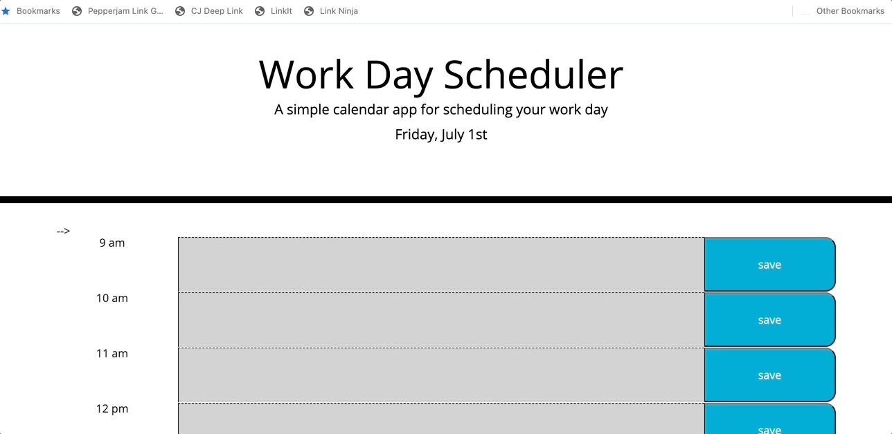

# work-day-scheduler

## Description

This code creates an editable calendar for the work day. Core working hours appear with editable text boxes to save a schedule throughout the day. The user is able to save their text in the text area using the save button on the right. When the page is reloaded, the schedule will remain.

When the user wants to remove any items they completed or want to change, they can simply delete the text and click the save button again.

https://mardill.github.io/work-day-scheduler/

## Installation

This code can be used with access to html, css, Jquery and Javascript that can be run in a browser.

## Usage

This application is great for anyone that wants to keep track of their day by the hour. The user can add and save any text to any hour using the save button which utilizes local storage.

The current hour will appear in red, past time in grey, and future time in green. This allows for quick visualization of where the user is at in the day. 

## License

MIT License

Copyright (c) 2022 mardill

Permission is hereby granted, free of charge, to any person obtaining a copy
of this software and associated documentation files (the "Software"), to deal
in the Software without restriction, including without limitation the rights
to use, copy, modify, merge, publish, distribute, sublicense, and/or sell
copies of the Software, and to permit persons to whom the Software is
furnished to do so, subject to the following conditions:

The above copyright notice and this permission notice shall be included in all
copies or substantial portions of the Software.

THE SOFTWARE IS PROVIDED "AS IS", WITHOUT WARRANTY OF ANY KIND, EXPRESS OR
IMPLIED, INCLUDING BUT NOT LIMITED TO THE WARRANTIES OF MERCHANTABILITY,
FITNESS FOR A PARTICULAR PURPOSE AND NONINFRINGEMENT. IN NO EVENT SHALL THE
AUTHORS OR COPYRIGHT HOLDERS BE LIABLE FOR ANY CLAIM, DAMAGES OR OTHER
LIABILITY, WHETHER IN AN ACTION OF CONTRACT, TORT OR OTHERWISE, ARISING FROM,
OUT OF OR IN CONNECTION WITH THE SOFTWARE OR THE USE OR OTHER DEALINGS IN THE
SOFTWARE.